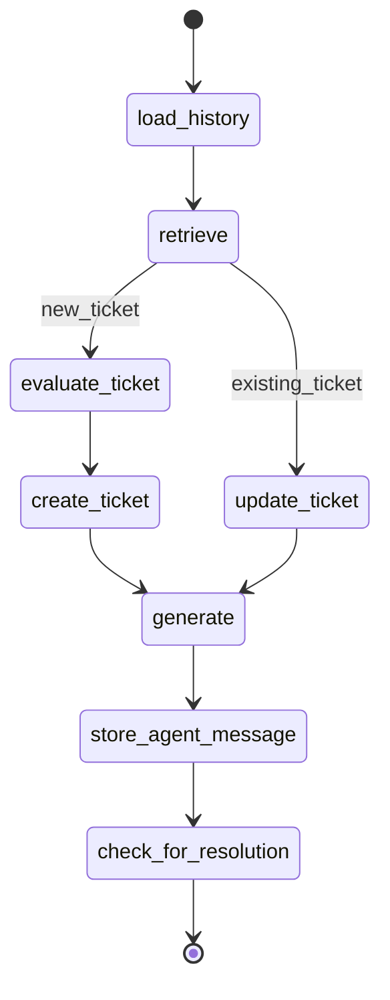

# 🎫 Ticket Agent

An intelligent multi-role support ticket agent powered by **LangGraph** and **Snowflake Cortex** and **Streamlit**. This system automates the lifecycle of a support ticket—from initial AI-driven triage and priority classification to human-in-the-loop administrative resolution.

## ✨ Features

- **Smart New-Ticket Evaluation** – Evaluates new issues (priority + metadata) before ticket creation and response generation
- **Snowflake Cortex Search** – Retrieves relevant past tickets and knowledge base context to inform responses
- **AI + Human Support Loop** – Combines AI-generated replies with admin human-in-the-loop intervention in the same chat threads
- **Lifecycle Tracking & Resolution** – Stores all agent messages and runs resolution checks to keep ticket status up to date


### 👥 **Dual-Role Interface**

The system features a **unified routing architecture** in `frontend/app.py` that allows seamless switching between two distinct user experiences, managed via a global sidebar toggle.

#### 👤 **User Experience**

- **Support Desk Landing**: A dedicated home page to **raise new problems** or check the status of existing ones.
- **Live Status Tracking**: Real-time ticket lookups with **direct "Open Chat" links** to resume active conversations.
- **Ticket History**: A searchable, tabular overview of all **personal past tickets** for easy reference.
- **AI-Driven Chat**: Direct interaction with the **Mistral-powered agent** for immediate troubleshooting and automated triage.

#### 🔑 **Administrator Dashboard**

- **Queue Management**: A comprehensive view of all system tickets with **visual color indicators** for priority (URGENT to LOW) and status.
- **Advanced Triage**: Built-in tools to **filter the queue** by status (OPEN/CLOSED) and sort by urgency, subject, or update recency.
- **Human-in-the-Loop Override**: Admins can enter any active chat thread to provide **manual assistance** alongside the AI agent.
- **One-Click Resolution**: Streamlined controls to **close resolved tickets** directly from the dashboard or within the chat view.

#### 💬 **Hybrid Chat System**

- **Shared Interface**: Both roles utilize the same `user_chat.py` component, ensuring a **consistent history** of both AI and human responses.
- **Visual Role Cues**: The chat interface identifies messages from **"Users," "AI Agents," and "Human Agents" (Admins)** using distinct avatars and alignments to maintain clarity.

## 🏗️ Architecture

The agent uses a LangGraph state machine with the following workflow:



### Nodes

| Node | Description |
|------|-------------|
| `load_history` | Loads past ticket messages |
| `evaluate_ticket` | Evaluates ticket priority and metadata for new tickets |
| `retrieve` | Fetches relevant context from Snowflake Cortex Search |
| `generate` | Generates a support response based on priority and context |
| `create_ticket` | Creates a new ticket in the database |
| `update_ticket` | Adds a message to an existing ticket |
| `store_agent_message` | Persists the agent's response |
| `check_for_resolution` | Checks if the issue is resolved and updates ticket status |

## 📁 Project Structure

```
ticket_agent/
├── backend/
│   ├── agent.py                     # Main agent entry point
│   ├── db/
│   │   ├── snowflake_utils.py       # Snowflake session management utils
│   │   ├── sql_utils.py             # SQL execution helpers
│   │   ├── zen_repo.py              # Ticket repository operations
│   │   ├── csv/                     # CSV files for sample data
│   │   ├── tables/                  # SQL table definitions
│   │   ├── views/                   # SQL view definitions
│   │   └── cortex_search_services/  # SQL cortex definitions
│   ├── graph/
│   │   ├── graph.py                 # LangGraph workflow definition
│   │   ├── router.py                # Conditional routing logic
│   │   ├── state.py                 # State schema definition
│   │   └── nodes/                   # Individual graph nodes
│   └── llm/
│       └── model.py                 # LLM configuration
├── scripts/
│   ├── setup_db.py                  # Database setup script
│   └── chat_with_agent.py           # CLI chat interface
├── frontend/
│   ├── app.py                       # Streamlit app entry point
│   └── views/                       # Streamlit app pages
├── requirements.txt
├── Makefile
└── .env.example
```

## 🚀 Getting Started

### Prerequisites

- Python 3.10+
- Snowflake account with Cortex enabled
- Mistral API key (used in `backend/llm/model.py`, you can change the code to use another LLM)
- Environment: Ensure your .env contains your Snowflake credentials and MISTRAL_API_KEY

### Installation

1. **Clone the repository**
   ```bash
   git clone <repository-url>
   cd ticket_agent
   ```

2. **Create and activate a virtual environment**
   ```bash
   make venv
   source venv/bin/activate
   ```

3. **Configure environment variables**
   
   Copy the example file and fill in your credentials:
   ```bash
   cp .env.example .env
   ```

   Required variables:
   | Variable | Description |
   |----------|-------------|
   | `SNOWFLAKE_ACCOUNT` | Your Snowflake account identifier |
   | `SNOWFLAKE_USER` | Snowflake username |
   | `SNOWFLAKE_TOKEN` | Snowflake password/token |
   | `MISTRAL_API_KEY` | API key |
   | `SNOWFLAKE_WAREHOUSE` | Compute warehouse name |
   | `SNOWFLAKE_DATABASE` | Database containing your data |
   | `SNOWFLAKE_SCHEMA` | Schema name |
   | `SNOWFLAKE_CORTEX_SEARCH_SERVICE` | Cortex Search service name |

### Running the Agent

To test the agent through command line, run:

```bash
make run_agent
# or
PYTHONPATH=.:backend python scripts/chat_with_agent.py
```

### Running the Frontend

Start the ticketing system UI:

```bash
make app
# or
streamlit run frontend/app.py
```

## 🛠️ Technologies

- **[LangGraph](https://github.com/langchain-ai/langgraph)** – Stateful agent orchestration
- **[LangChain](https://github.com/langchain-ai/langchain)** – LLM integration
- **[Snowflake](https://www.snowflake.com)** – Data storage and processing
- **[Snowflake Cortex](https://www.snowflake.com/en/data-cloud/cortex/)** – Semantic search & LLM inference
- **[Streamlit](https://streamlit.io/)** - App frontend
